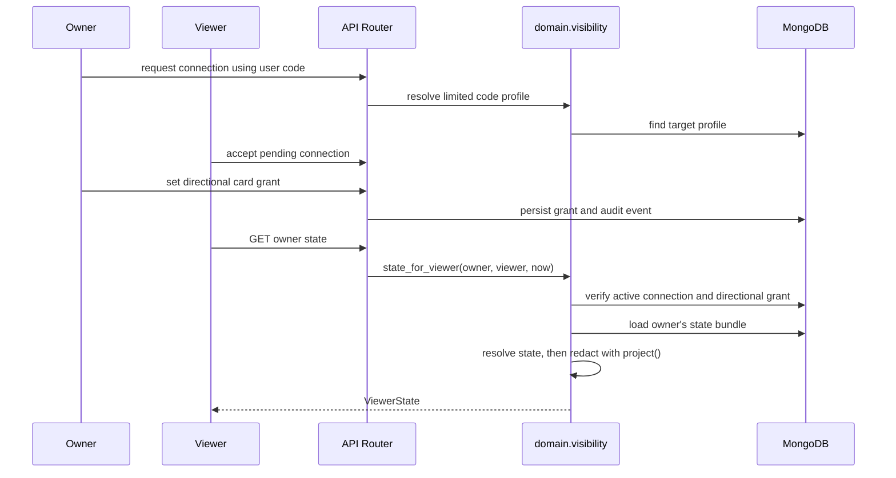

# CircleCue System Architecture

## Product and Constraints

CircleCue is a private, permission-based context network. Connections are mutual, grants are directional, and a newly accepted connection has zero card access. It is not a social feed and does not track location by default. The authoritative product, stack, data contracts, defaults, and module status live in [MEMORY.md](MEMORY.md); the root [AGENTS.md](../AGENTS.md) defines the implementation rules.

## Established Build Pattern

- M00 provides the FastAPI and Next.js scaffold, configuration, local compose, clock, and Sentry setup.
- M01 defines the Pydantic collection/API models, lifecycle transition tables, async MongoDB access, indexes, and type-generation script.
- M02 implements registration, login, profile, universal user codes, sharing pause, export, and deletion.
- M03 owns mutual connections, directional grants, audit events, profile projection, and the single cross-user visibility boundary.
- M04 builds pure schedule expansion, free-window calculation, resolved state, and lifecycle event behavior on top of M01 and M03.

Routes use FastAPI dependencies for the authenticated user, database, and injected clock. Request/response contracts use Pydantic. Domain calculations receive `now` and structured data as arguments; they do not query MongoDB. Repository-backed cross-user reads are the exception and are owned by `domain/visibility.py`, which authorizes, loads, resolves, and projects the data before returning it to a router.

## M03: Connections and Visibility

Connection status and card grants are separate. A connection moves through pending to active; accepting it never creates a grant. Each grant is owned by the person sharing data and names one viewer. Card access is `none`, `status`, or `details`; notification flags and relationship presets do not confer additional read permission.

`project()` is the policy choke point. It rejects absent, expired, revoked, or mismatched grants; only an active grant holder can see the neutral sharing-paused state. Status projections omit details; private-label and viewer-only activity rules are applied after resolution. The arbitrary `last_shared_context` snapshot is exposed only with `safety: details`, because its untyped keys cannot be safely filtered against lower card levels. Boundary timestamps are returned only when projected state makes them relevant.

`viewers_for()` is the notification-candidate query: the viewer must have an active connection and an unexpired, unrevoked grant for the requested card/level. Delivery-time revocation checks remain required in M08; candidate selection alone is not sufficient authorization to deliver later.

## M04: State Resolution

The resolver is a pure `(UserBundle, now) -> ResolvedState` calculation. State is not persisted as a second source of truth. `expand()` converts local-time templates, exceptions, and exam sets into ordered UTC segments; `free_windows()` applies the routine buffer and minimum call-window thresholds; `resolve()` chooses the currently true state and its next boundary. Temporal, when added, may trigger recalculation or notifications but must not decide what state is true.

Current precedence, highest first:

1. Safety or active context packet
2. Manual live activity or availability override
3. Active travel
4. Exam set
5. Scenario-produced activity
6. Schedule and date exceptions
7. Routine baseline
8. Unknown

Within schedule overlaps, the active segment with the latest start wins and a count-only warning is logged. Cross-midnight schedule segments are carried into the following local date. Reachability is a separate projection from phone state; phone battery/offline fields do not independently imply activity. Expired manual activities are ignored so the resolver falls through instead of presenting stale status.

## API Boundaries

- `GET /state/me` resolves the caller's state.
- `GET /state/{owner_id}` delegates cross-user authorization and projection to `visibility.state_for_viewer()`.
- `GET /timeline?date=` returns the caller's expanded schedule and free windows.
- `GET /timeline/{owner_id}?date=` requires an active connection and schedule status access; segments are projected for the viewer.
- `/connections/*` manages the mutual relationship; `/grants/*` manages directional access and the outgoing/incoming visibility views.

The API contract snapshot and TypeScript API types are regenerated with `python scripts/gen_types.py`. Manual end-to-end checks are listed in [SMOKE.md](SMOKE.md).

## M05: Cards

`cards/registry.py` maps each card key to its activity types, metadata model, defaults, notification kinds, lifecycle setting, grant key, and an existing collection/model. `routers/cards.py` is generic over this registry: owner-only list/create/update/delete operations validate with the registered Pydantic model, assign the authenticated owner, persist to the existing collection, audit the write, and publish a domain event. Activity mutations use version-checked lifecycle transitions; other mutable card records carry additive version counters. Schedule exceptions and bulk saves, exam-season counts, quick-message templates/reactions, critical-phone snapshots, and message-audience authorization extend the same card models rather than introducing scenario-specific storage. A planned travel card emits `TRAVEL_PLANNED`; only the transition to travelling emits `TRAVEL_STARTED` for M08's Arrival Watch interface.

## M06: AI Draft Service

`ai/schemas.py` defines a discriminated draft union. The adapters implement Ollama-native `/api/chat` with a schema in `format`, OpenAI-compatible `/v1/chat/completions` with JSON Schema `response_format`, and deterministic `RulesProvider` fallback. `AIService` validates, retries once, falls through configured providers, resolves times using the injected clock and owner timezone, matches names only against the owner's active connection profiles, and merges required-field questions. `POST /ai/parse` returns drafts only; it writes invocation telemetry but stores raw text only with owner opt-in. `POST /ai/confirm` is the only AI flow that persists entities, through existing M05 writers, and adds `ai_parsed_user_confirmed` provenance. Sentry span data contains provider/model/timing/schema/intent counts, not text.

The checked-in rules fallback is usable without a running model and covers activity, travel/phone, cancellation, and simple weekly scenario utterances. The primary open-weight endpoint has not been exercised in this environment; the required 60-case model evaluation is also pending.

## M07: Custom Scenarios

`domain/scenarios.py` defines the trigger/effect DSL and pure time-trigger evaluator. It converts active time windows through M04 `expand()`, then chooses by priority, specificity, and restrictiveness. `routers/scenarios.py` provides owner-scoped versioned CRUD and dry-run preview. The preview uses `visibility.viewers_for()` and intersects requested recipients with active grants; denied recipients are warned, never auto-granted. Confirmed AI time scenarios are stored using the same DSL. Activity-state/battery triggers and event delivery remain later work; M08 still owns notification delivery and workflow timers.

## Current Boundaries

M03's functional path is implemented and tested, but its requested 100% branch-coverage measurement is pending because the current Python environment does not include coverage tooling. M04 and M05 are implemented and covered by the API test suite. M06 and M07 core paths are in progress; the live DigitalOcean model, 60-case evaluation, event triggers, notifications, and Temporal integration have not been verified. Later modules must extend these contracts rather than adding scenario-specific engines or bypassing visibility.
